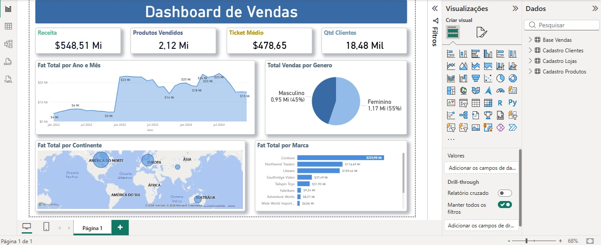

📊 Dashboard de Vendas — Power BI
Análise completa de vendas com indicadores de receita, produtos, ticket médio e clientes, segmentado por período, gênero, continente e marca.

📸 Preview

📈 Indicadores Principais
MétricaValor💰 Receita Total$548,51 Mi📦 Produtos Vendidos2,12 Mi🎯 Ticket Médio$478,65👥 Qtd Clientes18,48 Mil

📊 Visualizações

Fat Total por Ano e Mês — Evolução temporal do faturamento (jan/2022 a dez/2024)
Total Vendas por Gênero — Distribuição entre Feminino (55%) e Masculino (45%)
Fat Total por Continente — Mapa mundial com bolhas por volume de vendas
Fat Total por Marca — Ranking das principais marcas (destaque para Contoso com $223,98 Mi)

🛠 Como Usar

Clone ou baixe este repositório
Abra o arquivo relatorio_vendas.pbix no Power BI Desktop
Se necessário, atualize o caminho das fontes de dados em:
Página inicial > Transformar dados > Configurações da fonte de dados
Clique em Atualizar para carregar os dados mais recentes

🔧 Requisitos

Power BI Desktop
Microsoft Excel
